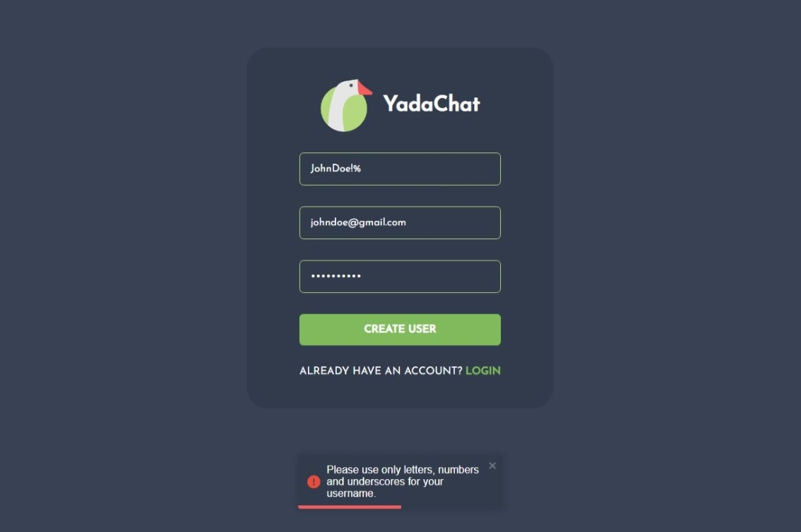
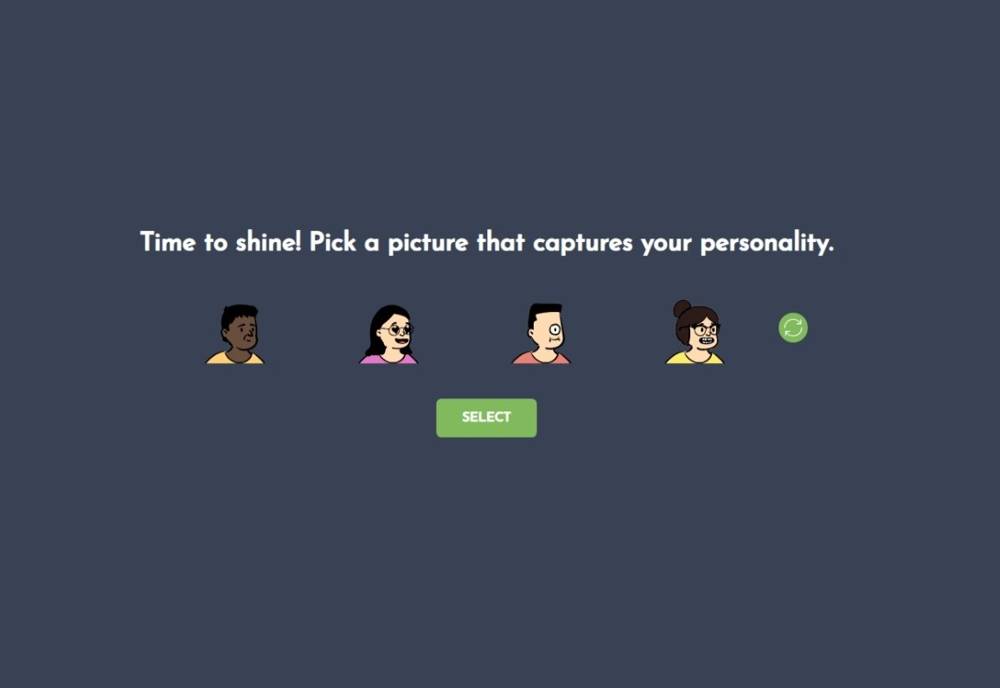
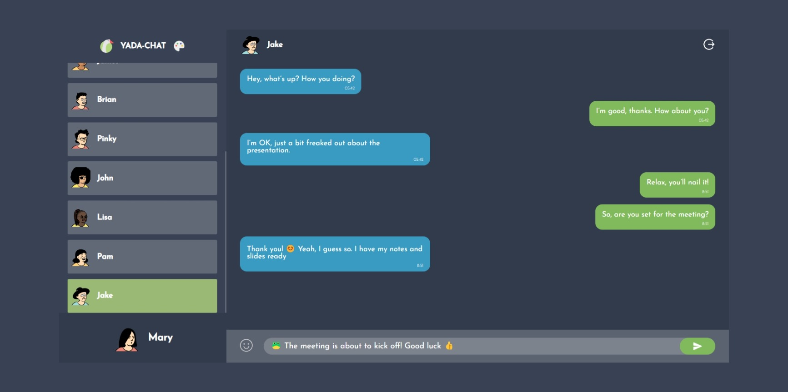
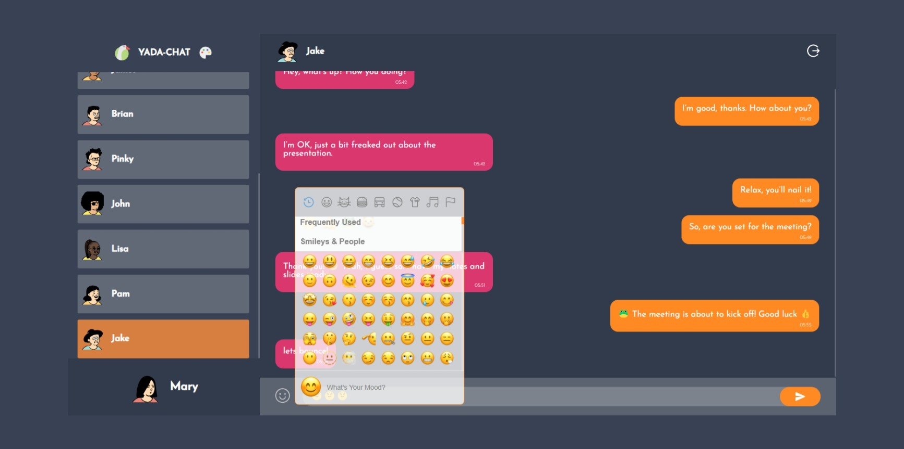

# YadaChat - Chat Application

YadaChat is chat application built with the power of MERN Stack and [socket.io](https://socket.io/). MERN Stack is a full-stack web development framework that consists of MongoDB, Express, React, and Node.js. It allows you to create dynamic and scalable web applications using JavaScript as the main programming language. Socket.io is a library that enables real-time, bidirectional and event-based communication between the browser and the server.

## Features

- Real-time chat with other users
- Input validation with error notifications using [react-toastify](https://www.npmjs.com/package/react-toastify) library
- Emojis support using [emoji-picker-react](https://www.npmjs.com/package/emoji-picker-react) library
- Randomly generated profile pictures using [dicebear.com API](https://www.dicebear.com/)
- Color scheme customization using React context

## Screenshots









## Installation Guide

### Requirements

- Nodejs
- Mongodb

To install YadaChat, follow these steps:

```shell
# Clone the repository
git clone https://github.com/julbrn/chat-app.git

# Change directory to the server folder
cd chat-app-react/server

# Create an env file containing PORT and MONGO_URL variables

# Install the dependencies for the server
cd server
yarn

# Install the dependencies for the client
cd client
yarn
```

We are almost done, now start the development servers.

For the backend:

```shell
cd server
yarn start
```

For the frontend:

```shell
cd client
yarn start
```

Done! Now open localhost:3000 in your browser and enjoy chatting with YadaChat.
